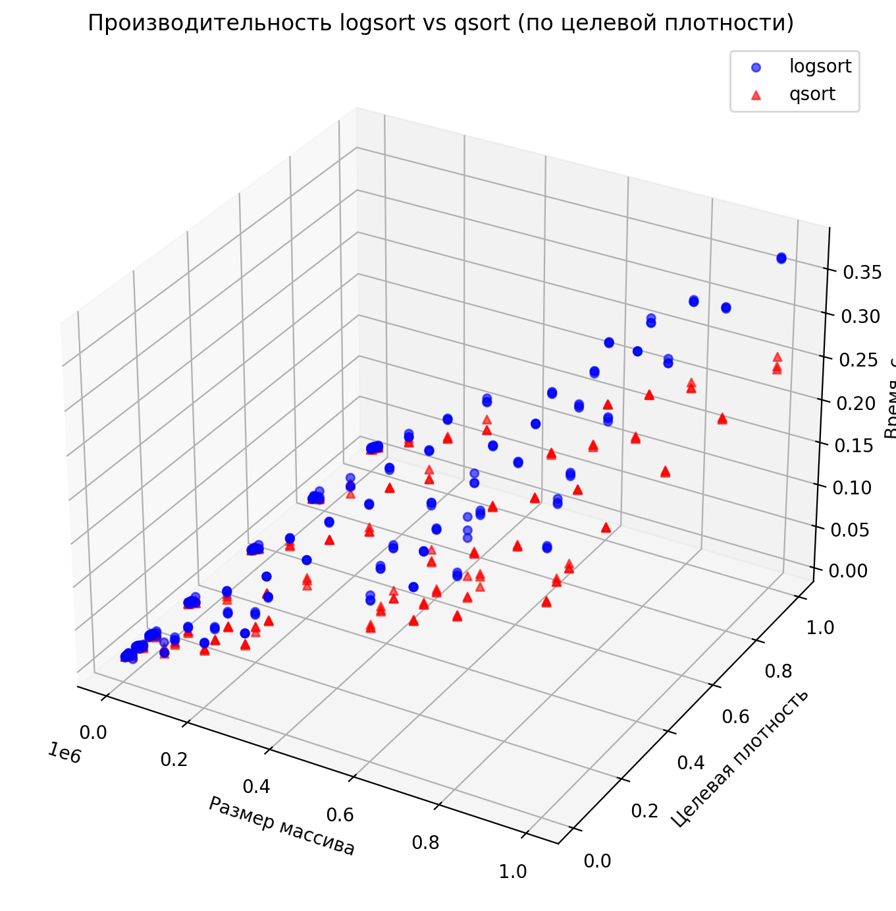
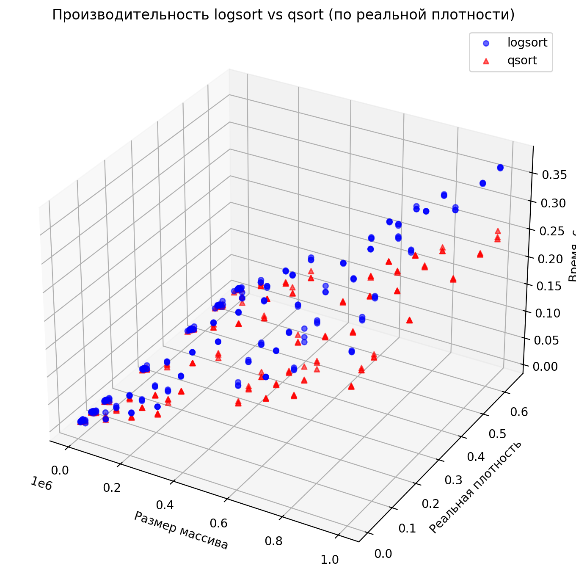
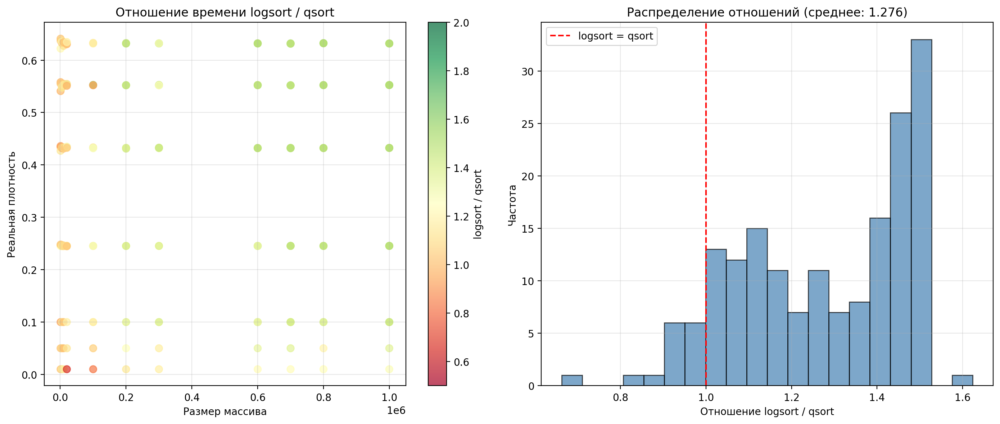

# Logsort: In-Place Stable O(n log n) Sorting Algorithm

## Introduction

In today's world, sorting plays an important role. This is especially true for databases. Most sorts can be divided into two types. These are stable and in-place sorts. Stable sorting is called sorting that preserves relative order. These include selection sorting and bubble sorting. In-place sorts use some constant (or limited) amount of memory. These include quicksort, heapsort, shellsort, blitsort, and others.

The algorithm performs stable partitioning in O(n) time using O(log n) space, then recursively sorts the partitions. This results in an overall O(n log n) time complexity while maintaining stability and near-in-place operation.

## Motivation

Sorting is mainly used in databases. However, there are many other uses, from trivial sorts for quick search, to sophisticated sorts for optimal data storage. It is important that the requirement of stability and in-place is fundamental for any sorting. That is why the goal was and still is to invent and implement such algorithms.

**Logsort** provides a simpler alternative that maintains the desirable properties of being both in-place and stable with optimal O(n log n) time complexity, making it suitable for applications where memory is constrained but stability is required.

## Algorithm

Logsort's core innovation is its stable partitioning algorithm that operates in O(n) time using O(log n) space. The partitioning process consists of four main phases:

### Grouping Phase

Elements are grouped into blocks of fixed size O(log n) using the available extra space. The algorithm uses a bucket-based approach to collect elements into blocks:

```
Grouping blocks of size 2:

        ↓ move to ones bucket
array: [1, 0, 1, 1, 0, 0, 1, 1]
zeros: [ ,  ]
 ones: [ ,  ]
 
           ↓ move to zeros bucket
array: [ , 0, 1, 1, 0, 0, 1, 1]
zeros: [ ,  ]
 ones: [1,  ]
 
              ↓ move to ones bucket
array: [ ,  , 1, 1, 0, 0, 1, 1]
zeros: [0,  ]
 ones: [1,  ]
 
array: [ ,  ,  , 1, 0, 0, 1, 1]      
zeros: [0,  ]
 ones: [1, 1] ← ones bucket full: output back into array

        ↓  ↓ first block created: continue looping
array: [1, 1,  , 1, 0, 0, 1, 1]
zeros: [0,  ]
 ones: [ ,  ] 
                          ↓ output zeros
array: [1, 1, 0, 0, 1, 1,  ,  ]
zeros: [0,  ]
 ones: [1,  ]

                             ↓ output ones
array: [1, 1, 0, 0, 1, 1, 0,  ]
zeros: [ ,  ]
 ones: [1,  ]


array: [1, 1, 0, 0, 1, 1, 0, 1]

       ┌──── blocks ────┐ ↓ leftover zeros
       [1, 1][0, 0][1, 1][0][1]
```


At the end of this phase, we have complete blocks and possibly some leftover elements that don't form a complete block.
> Since each element is moved a constant amount of times, once to the bucket and once back to the array, the grouping phase is O(n) regardless of block size but requires O(block size) extra space.

### Bit Encoding

Pairs of 0 and 1 blocks are encoded with unique indices by swapping elements between blocks. This encoding uses the blocks themselves to store indexing information:

```
Encode decimal number 13 = 0b1101:

[0, 0, 0, 0, 0] [1, 1, 1, 1, 1]
 ↑  ↑     ↑      ↑  ↑     ↑
 1  2     3      1  2     3  ← swap the following
          
┌─── 13 ───┐    ┌── ~13 ───┐
[1, 1, 0, 1, 0] [0, 0, 1, 0, 1] ← encoded with 13
```
Using this technique, pairs of 0 and 1 block are encoded with a unique index during the encoding phase.  We maintain two iterators: one for 0 blocks and 1 blocks respectively:

```
Encode blocks:

 (0)  (0)
[ 0 ][ 1 ][ 1 ][ 1 ][ 0 ][ 1 ][ 0 ][ 1 ]
└───┘└───┘ encode 0

 (0)  (0)  (1)       (1)
[ 0 ][ 1 ][ 1 ][ 1 ][ 0 ][ 1 ][ 0 ][ 1 ]
          └───┘     └───┘ encode 1

 (0)  (0)  (1)  (2)  (1)       (2)
[ 0 ][ 1 ][ 1 ][ 1 ][ 0 ][ 1 ][ 0 ][ 1 ]
               └───┘          └───┘ encode 2 and finish
```

In this example, there were fewer 0 blocks, so all 0 blocks get encoded leaving some 1 blocks untouched.  These leftover blocks will be handled in the swapping phase.

> Encoding an index costs O(log n) swaps.  Since each block is size O(log n), there are O(n/log n) blocks, so this phase is O(n/log n) \* O(log n) = O(n).

### Swapping the Blocks

Blocks from the larger partition are swapped to their correct positions. This preserves the order of one partition but scrambles the other:

```
Swap blocks:

 (0)   (0)   (1)   (2)   (1)         (2)
[ 0a ][ 1a ][ 1b ][ 1c ][ 0b ][ 1d ][ 0c ][ 1e ]
                              └────┘└────┘ block swap

 (0)   (0)   (1)   (2)   (1)   (2)
[ 0a ][ 1a ][ 1b ][ 1c ][ 0b ][ 0c ][ 1d ][ 1e ]
                  └────┘      └────┘ block swap

 (0)   (0)   (1)   (2)   (1)   (2)
[ 0a ][ 1a ][ 1b ][ 0c ][ 0b ][ 1c ][ 1d ][ 1e ]
            └────┘      └────┘ block swap

 (0)   (0)   (1)   (2)   (1)   (2)
[ 0a ][ 1a ][ 0b ][ 0c ][ 1b ][ 1c ][ 1d ][ 1e ]
      └────┘      └────┘ block swap

 (0)   (2)   (1)   (0)   (1)   (2)
[ 0a ][ 0c ][ 0b ][ 1a ][ 1b ][ 1c ][ 1d ][ 1e ]
                         (finished block swapping)
```

Swapping blocks in this fashion preserves the order of the 1 blocks.  If there were more 0 blocks, we would swap them to the left.  In this example, after swapping, the 1's partition is stably ordered.  However, the order of the 0 blocks is now scrambled.  Using the encoded indices in the 0 blocks, we can reorder them stably in the sorting phase.

> Each block in the phase is swapped once.  Since each block swap costs O(log n) swaps and there are at most O(n/log n) blocks swapped, the swapping phase is O(n/log n) \* O(log n) = O(n).

### Sorting the Blocks

The scrambled partition is reordered using the encoded indices. By iterating through blocks and swapping them to their correct positions based on their encoded indices, the original order is restored:

```
Sort blocks:

 (0)←  (2)   (1)   (0)   (1)   (2)
[ 0a ][ 0c ][ 0b ][ 1a ][ 1b ][ 1c ][ 1d ][ 1e ]
└────┘ 0th block == 0 ? -> Yes: go to next block

 (0)   (2)←  (1)   (0)   (1)   (2)
[ 0a ][ 0c ][ 0b ][ 1a ][ 1b ][ 1c ][ 1d ][ 1e ]
      └────┘ 1st block == 2 ? -> No: swap with 2nd block

 (0)   (1)   (2)   (0)   (1)   (2)
[ 0a ][ 0b ][ 0c ][ 1a ][ 1b ][ 1c ][ 1d ][ 1e ]
      └────┘└────┘

 (0)   (1)←  (2)   (0)   (1)   (2)
[ 0a ][ 0b ][ 0c ][ 1a ][ 1b ][ 1c ][ 1d ][ 1e ]
      └────┘ 1st block == 1 ? -> Yes: go to next block

 (0)   (1)   (2)←  (0)   (1)   (2)
[ 0a ][ 0b ][ 0c ][ 1a ][ 1b ][ 1c ][ 1d ][ 1e ]
            └────┘ 2nd block == 2 ? -> Yes: finish
```
It's worth noting in our example we sorted the blocks belonging to the 0 partition.  However, recall that the encoding of 1 blocks is the bit flip of 0 blocks, so we would need to bit flip the results of the decoding beforehand in the case of sorting 1 blocks. 

> Each time a block is swapped, it ends up in its final destination, therefore a block is swapped at most once.  The blocks are also decoded at most twice: once per block swap and once per iterated block.  
> 
> Combined, the operations on a block are O(log n).  Since there are at most O(n/log n) scrambled blocks, the sorting phase is O(n/log n) \* O(log n) = O(n).
After the sorting phase, the blocks are now partitioned stably in O(n) time.  However, some elements between blocks are still swapped from the encoding phase, and we want to restore the original states of the blocks.  Since both 0 blocks and 1 blocks are in order, we can easily reaccess the original encoded block pairs along with their indices in ascending order.  We then can "uncode" them by applying the encode algorithm again with the same index.  After iterating and uncoding the block pairs, we complete the partition on the blocks.

```
Uncode blocks:

 (0)   (1)   (2)   (0)   (1)   (2)
[ 0a ][ 0b ][ 0c ][ 1a ][ 1b ][ 1c ][ 1d ][ 1e ]
└────┘            └────┘ uncode 0 (encode 0)

       (1)   (2)         (1)   (2)
[ 0a ][ 0b ][ 0c ][ 1a ][ 1b ][ 1c ][ 1d ][ 1e ]
      └────┘            └────┘ uncode 1 (encode 1)

             (2)               (2)
[ 0a ][ 0b ][ 0c ][ 1a ][ 1b ][ 1c ][ 1d ][ 1e ]
            └────┘            └────┘ uncode 2 (encode 2)

[ 0a ][ 0b ][ 0c ][ 1a ][ 1b ][ 1c ][ 1d ][ 1e ]
[       0        ][             1              ]

blocks and underlying elements partitioned stably!
```

We are not done yet and still have a leftover chunk of 0's that did not make a complete block from the grouping phase.  Simply copy the 0 leftovers, shift the 1's partition to the right, and copy the leftovers back:

```
Clean up:

[0 0 0 0 0][1 1 1 1 1 1 1 1 1 1 1 1][0 0 0][1 1 1]
                                    └─────┘ copy out
                                    
[0 0 0 0 0][1 1 1 1 1 1 1 1 1 1 1 1]       [1 1 1]
           └───────────────────────┘ shift --->

[0 0 0 0 0]       [1 1 1 1 1 1 1 1 1 1 1 1][1 1 1]
           └─────┘ copy in

[0 0 0 0 0][0 0 0][1 1 1 1 1 1 1 1 1 1 1 1][1 1 1]
└─────── 0 ──────┘└────────────── 1 ─────────────┘

partition complete!
```
> There are O(n/log n) pairs of blocks that need to be uncoded.  Since each uncoding operation is O(log n), it costs O(n/log n) \* O(log n) = O(n) operations.
> 
>  Copying the leftovers and shifting the 1's partition is O(n) + O(log n) = O(n).

Finally, the blocks are "uncoded" to restore their original element composition, and any leftover elements from the grouping phase are properly placed.


## Implementation

The Logsort algorithm is implemented in C with the following interface:

```c
void logsort(void *array, size_t size_of_array, size_t size_of_element, cmp_func_t cmp);
```

### Key Components

- **Stable Partitioning**: The core of the algorithm that partitions elements around a pivot while maintaining relative order of equal elements
- **Recursive Sorting**: Applies the stable partitioning recursively to sort the entire array
- **Insertion Sort Fallback**: Uses insertion sort for small subarrays (≤ 16 elements) for better performance
- **Pivot Selection**: Implements median-of-three pivot selection for better average performance

### Usage

Define your element type and comparison function, then call `logsort()` with your array:

```c
// Comparison function for integers
int cmp_int(const void *a, const void *b) {
    return *(int*)a - *(int*)b;
}

// Sort an integer array
int arr[] = {5, 2, 8, 1, 9, 3};
size_t n = sizeof(arr) / sizeof(arr[0]);
logsort(arr, n, sizeof(int), cmp_int);
```

## Complexity

- **Time Complexity**: O(n log n) worst-case and average-case
- **Space Complexity**: O(log n) extra space
- **Stability**: Yes - preserves relative order of equal elements

## BenchMarks

### Dependence on data density

In fact, any stable speed sorting strongly depends on the density of the data received, that is, on the proportion of unique among all. Thus, time measurements were carried out, depending on the size of the array and the density of the data. Graphs of **target** and **real** density are also provided. The **target** density is the density that we set as ideal for testing, the **real** density is the one that turned out in the end.
### Performance Charts

#### Target density graph


#### Real density graph


#### Timeline of the lead time relationship


## Advantages

- **Optimal Time Complexity**: O(n log n) performance matching the best comparison-based sorts
- **Near In-Place**: Uses only O(log n) extra space, making it suitable for memory-constrained environments
- **Stable**: Maintains relative order of equal elements, important for many applications
- **Practical**: Simpler to implement than other in-place stable sorts like Block Merge sorts

## Limitations

- **Constant Factors**: May have higher constant factors than highly optimized unstable sorts
- **Complex Implementation**: While simpler than Block Merge sorts, the algorithm is still more complex than basic Quicksort

## References

The algorithm is based on research into stable in-place partitioning and builds upon work in:

- Stable in-situ sorting and minimum data movement (Munro et al. 1990)
- https://github.com/aphitorite/Logsort/
- https://habr.com/ru/companies/edison/articles/483786/

## Conclusion

Logsort provides a practical solution to the challenging problem of efficient in-place stable sorting. By combining novel partitioning techniques with recursive sorting, it achieves optimal O(n log n) time complexity while using only O(log n) extra space and maintaining stability. This makes it suitable for applications where both memory efficiency and stability are important requirements.